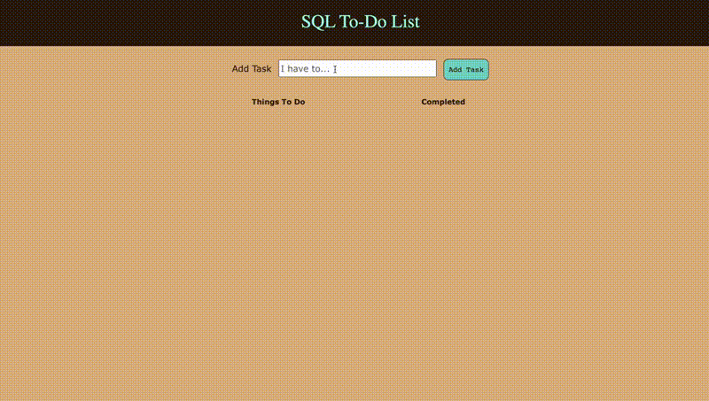

# CRUD To-Do List

[Project Instructions](./INSTRUCTIONS.md), this line may be removed once you have updated the README.md

## Description

Your project description goes here. What problem did you solve? How did you solve it?

Additional README details can be found [here](https://github.com/PrimeAcademy/readme-template/blob/master/README.md).
